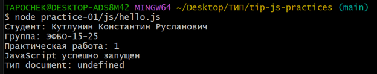
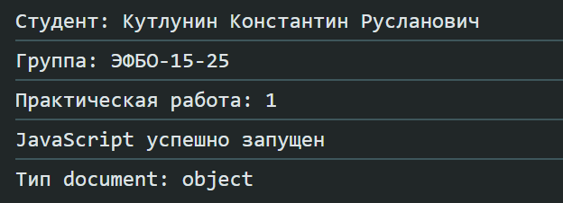
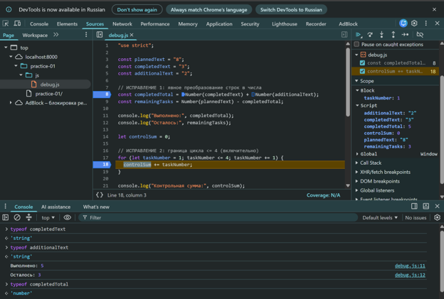

---

```markdown

# Практическая работа № 1

**Тема:** Подготовка окружения и первые программы на JavaScript

**Дисциплина:** Технологии индустриального программирования

**Автор:** Кутлунин Константин Русланович

**Группа:** ЭФБО-15-25

**Вариант:** 1 (номер по списку — 17)

**Проверил:** доцент Бочаров М.И.

**Москва, 2026**

---

## Окружение

| Инструмент | Версия |
|:---|:---|
| Node.js | v24.21.0 |
| npm | 11.19.0 |
| Git | 2.55.0.windows.5 |
| Браузер | Chrome (DevTools) |
| ОС | Windows |

---

## Запуск

Все команды выполняются **из корня репозитория** `tip-js-practices`.

### Запуск через Node.js

```bash
node practice-01/js/hello.js
node practice-01/js/types.js
node practice-01/js/progress.js
node practice-01/js/plan.js
node practice-01/js/debug.js
```

## Задание 1. Один файл — две среды выполнения

### Терминал VS Code (Node.js)

```text
$ node practice-01/js/hello.js
Студент: Кутлунин Константин Русланович
Группа: ЭФБО-15-25
Практическая работа: 1
JavaScript успешно запущен
Тип document: undefined
```

### Консоль браузера

```text
Студент: Кутлунин Константин Русланович
Группа: ЭФБО-15-25
Практическая работа: 1
JavaScript успешно запущен
Тип document: object
```

**Различие:** В Node.js `typeof document` возвращает `undefined`, потому что Node.js не предоставляет браузерный DOM. В браузере `document` — это объект, поэтому `typeof document` возвращает `object`.

---

## Задание 2. Исследование типов и преобразований

| Выражение | Ожидание до запуска | Фактическое значение | Тип результата | Объяснение |
|:---|:---|:---|:---|:---|
| `"8" + 2` | `"82"` | `"82"` | `string` | Оператор `+` со строкой делает конкатенацию (склеивание). |
| `"8" - 2` | `6` | `6` | `number` | Оператор `-` работает только с числами, поэтому строка `"8"` превращается в число `8`. |
| `Number("8") + 2` | `10` | `10` | `number` | `Number()` явно преобразует строку в число, поэтому выполняется арифметическое сложение, а не конкатенация. |
| `"12" > "3"` | `false` | `false` | `boolean` | Строки сравниваются посимвольно. Первый символ `"1"` меньше `"3"`, поэтому всё выражение `false`. |
| `12 === "12"` | `false` | `false` | `boolean` | Строгое равенство `===` не преобразует типы. Число не равно строке. |
| `Number("")` | `0` | `0` | `number` | Пустая строка при преобразовании в число даёт `0`. |
| `Number("text")` | `NaN` | `NaN` | `number` | `NaN` означает "Not a Number", но его тип — `number`. |
| `Boolean("false")` | `true` | `true` | `boolean` | Любая непустая строка (даже `"false"`) — это `true`. |
| `typeof null` | `"object"` | `"object"` | `string` | Историческая ошибка JavaScript. `null` — это примитив, но `typeof` выдаёт `object`. |
| `typeof NaN` | `"number"` | `"number"` | `string` | `NaN` относится к числовому типу данных. |

### Терминал VS Code (Node.js)



### Консоль браузера



---

## Задание 3. Сводка выполнения задач (progress.js)

| № | Проверка | totalTasks | completedTasks | Ожидаемый результат | Фактический результат | Итог |
|:--:|:---|:---:|:---:|:---|:---|:---:|
| 1 | Обычный случай | 12 | 5 | 41.7%, В работе | Всего задач: 12<br>Выполнено: 5<br>Осталось: 7<br>Прогресс: 41.7%<br>Статус: В работе | ✅ Пройдено |
| 2 | Нулевые данные | 0 | 0 | «Задач пока нет» | Задач пока нет | ✅ Пройдено |
| 3 | Ничего не выполнено | 5 | 0 | 0.0%, Не начато | Всего задач: 5<br>Выполнено: 0<br>Осталось: 5<br>Прогресс: 0.0%<br>Статус: Не начато | ✅ Пройдено |
| 4 | Всё выполнено | 5 | 5 | 100.0%, Завершено | Всего задач: 5<br>Выполнено: 5<br>Осталось: 0<br>Прогресс: 100.0%<br>Статус: Завершено | ✅ Пройдено |
| 5 | Выполнено больше, чем всего | 5 | 6 | Ошибка | Ошибка: недопустимое количество задач | ✅ Пройдено |
| 6 | Отрицательное значение | -1 | 0 | Ошибка | Ошибка: недопустимое количество задач | ✅ Пройдено |
| 7 | Дробное число | 5 | 2.5 | Ошибка: дробное | Ошибка: количество задач должно быть целым числом | ✅ Пройдено |
| 8 | Строка вместо числа | "5" | 2 | Ошибка: строка | Ошибка: количество задач должно быть числом | ✅ Пройдено |
| 9 | Превышена верхняя граница | 1001 | 0 | Ошибка | Ошибка: недопустимое количество задач | ✅ Пройдено |
| 10 | NaN | NaN | 0 | Ошибка | Ошибка: количество задач должно быть целым числом | ✅ Пройдено |

### Пояснения

* **Почему в проверке 10 (NaN) выводится ошибка о целочисленности, а не о типе?** Потому что `typeof NaN === "number"` — это правда. Тип проходит проверку. Но `Number.isInteger(NaN)` возвращает `false`, поэтому срабатывает проверка целочисленности.
* **Почему в проверке 1 процент 41.7%, а не 41.666...?** Потому что используется `percentage.toFixed(1)` — метод, который округляет число до одного знака после запятой и возвращает строку.
* **Почему в проверке 4 статус «Завершено», а не «В работе»?** Потому что статус определяется по исходным количествам, а не по проценту. Условие `completedTasks === totalTasks` даёт `true` только когда выполнено всё.

---

## Задание 4. План выполнения задач по дням (plan.js)

| № | Проверка | totalTasks | completedTasks | dailyLimit | Ожидаемый результат | Фактический результат | Итог |
|:--:|:---|:---:|:---:|:---:|:---|:---|:---:|
| 1 | Обычный случай | 12 | 5 | 3 | 3 дня; в последний день 1 задача | Осталось 7<br>День 1: 3, осталось 4<br>День 2: 3, осталось 1<br>День 3: 1, осталось 0<br>Потребуется дней: 3 | ✅ |
| 2 | Ровно по норме | 10 | 4 | 3 | 2 дня по 3 задачи | Осталось 6<br>День 1: 3, осталось 3<br>День 2: 3, осталось 0<br>Потребуется дней: 2 | ✅ |
| 3 | Норма больше остатка | 5 | 3 | 10 | 1 день, 2 задачи | Осталось 2<br>День 1: 2, осталось 0<br>Потребуется дней: 1 | ✅ |
| 4 | Всё выполнено | 5 | 5 | 2 | 0 дней, цикл не запускается | Все задачи уже выполнены.<br>Потребуется дней: 0 | ✅ |
| 5 | Нулевые данные | 0 | 0 | 2 | 0 дней, цикл не запускается | Все задачи уже выполнены.<br>Потребуется дней: 0 | ✅ |
| 6 | Нулевая норма | 5 | 2 | 0 | Ошибка, цикл не запускается | Ошибка: недопустимая дневная норма. | ✅ |
| 7 | Дробная норма | 5 | 2 | 1.5 | Ошибка: дробное число | Ошибка: все значения должны быть целыми числами. | ✅ |
| 8 | Выполнено больше, чем всего | 5 | 6 | 2 | Ошибка | Ошибка: недопустимое количество задач. | ✅ |
| 9 | Норма строкой | 5 | 2 | "2" | Ошибка: строка | Ошибка: все значения должны быть числами. | ✅ |
| 10 | Превышена верхняя граница | 5 | 2 | 1001 | Ошибка | Ошибка: недопустимая дневная норма. | ✅ |

### Пояснения

* В проверке 1 цикл `while` выполняется 3 раза. В последний день `Math.min(3, 1)` возвращает `1`, поэтому в последний день выполняется только 1 задача, а не 3.
* В проверке 2 остаток равен 6, норма 3. Цикл выполняется 2 раза, каждый день по 3 задачи. Остаток становится 0 после второй итерации, и цикл завершается.
* В проверке 3 норма (10) больше остатка (2), поэтому `Math.min(10, 2)` возвращает `2`. Цикл выполняется 1 раз.
* В проверках 4 и 5 цикл `while` не запускается, потому что условие `remaining > 0` сразу ложно. Выводится «Потребуется дней: 0».
* В проверке 6 (`dailyLimit = 0`) срабатывает проверка `dailyLimit < 1`. Без неё цикл стал бы бесконечным, так как `Math.min(0, remaining)` всегда 0, и остаток никогда не уменьшался бы.
* В проверке 7 (`dailyLimit = 1.5`) срабатывает `Number.isInteger()`, потому что норма должна быть целым числом.
* В проверке 9 (`dailyLimit = "2"`) срабатывает проверка `typeof ... !== "number"`, потому что строка не является числом.

---

## Задание 5. Поиск логических ошибок через DevTools

### Неправильный вывод (до исправления)

```text
Выполнено: 32
Осталось: -24
Контрольная сумма: 6
```

### Верный вывод (после исправления)

```text
Выполнено: 5
Осталось: 3
Контрольная сумма: 10
```

### Ошибка 1 — обработка количества задач

```javascript
const completedTotal = completedText + additionalText; // "3" + "2" = "32" (склейка строк)
const remainingTasks = plannedText - completedTotal;    // "8" - "32" = -24
```

Здесь `completedText` и `additionalText` — строки, а оператор `+` со строками делает конкатенацию, а не сложение. Нужно явно преобразовать их в числа через `Number()`.

### Ошибка 2 — граница цикла

```javascript
for (let taskNumber = 1; taskNumber < 4; taskNumber += 1) {
```

Условие `< 4` означает, что цикл выполнится для `1`, `2`, `3` — сумма будет `6`. Но по условию нужно суммировать от 1 до 4 включительно, значит условие должно быть `<= 4`. Тогда сумма будет `1+2+3+4 = 10`.

### Таблица ошибок

| Ошибка | Что наблюдалось | Причина | Исправление | Результат после исправления |
|:---|:---|:---|:---|:---|
| Обработка количества задач | `completedTotal = "32"`, `remainingTasks = -24` | Оператор `+` со строками выполняет конкатенацию, а не сложение. Переменные `completedText` и `additionalText` имели тип `string`. | Явное преобразование через `Number()`: `Number(completedText) + Number(additionalText)` | `completedTotal = 5`, `remainingTasks = 3` |
| Граница цикла | `controlSum = 6` вместо `10` | Условие `taskNumber < 4` не включает число 4. Цикл выполняется для 1, 2, 3. | Изменено условие на `taskNumber <= 4` | `controlSum = 10` |

### Отладка через точки останова



**Что было исследовано через DevTools:**

1. **Точка останова на строке 8** (`const completedTotal = ...`).
   * В панели **Scope** видно, что `completedText` и `additionalText` имеют тип `string`.
   * В **Console** проверено: `typeof completedText` → `'string'`, `typeof additionalText` → `'string'`.
   * Это объясняет, почему без `Number()` оператор `+` выполнял бы конкатенацию (`"3" + "2" = "32"`), а не сложение.

2. **Шаг Step over (F10)** — после выполнения строки 8:
   * `completedTotal` стало равно `5` (тип `number`), потому что мы явно преобразовали строки в числа.
   * `typeof completedTotal` → `'number'`.

3. **Точка останова на строке 18** (`controlSum += taskNumber;`) внутри цикла:
   * В панели **Scope** видно, как меняются `taskNumber` и `controlSum` на каждой итерации.
   * Цикл выполняется для `taskNumber = 1, 2, 3, 4` (благодаря условию `<= 4`), и `controlSum` становится равным `10`.
   * Если бы условие осталось `< 4`, цикл остановился бы на `taskNumber = 3`, и `controlSum` было бы `6`.

**Вывод:** Точки останова позволили увидеть типы переменных до вычисления и понять причину ошибки. Без них программа просто выводила бы неверный результат, и причину пришлось бы искать «наугад».

---

### Пояснения к дополнительному заданию (Вариант А)

* **Зачем `.trim()`:** Пользователь может случайно ввести `" 12 "` с пробелами. Без `trim()` функция `Number(" 12 ")` всё равно вернёт `12`, но `"   "` превратится в `0`, что даст ложный результат. Поэтому сначала обрезаем пробелы, потом проверяем на пустоту.

* **Почему недостаточно `Number()` + проверки «не отрицательно»:**  
  `Number("abc")` возвращает `NaN`. Сравнение `NaN < 0` даёт `false`, `NaN > totalTasks` тоже `false`. То есть `NaN` **проходит проверки границ**, но при этом не является числом. Поэтому нужна отдельная проверка `Number.isFinite()`, которая отсекает `NaN`, `Infinity` и `-Infinity`.

* **Порядок проверок важен:**  
  1. Тип (строка ли это).  
  2. `trim()` и пустота.  
  3. `Number()` → число ли это (`Number.isFinite`).  
  4. Целое ли число (`Number.isInteger`).  
  5. Границы (0…1000, completed ≤ total).  
  6. Особый случай 0/0.  
  7. Основной расчёт.

* **Обработка `null` и `undefined`:**  
  Проверка `typeof value !== "string"` отсекает их на первом шаге, не доводя до `trim()` (иначе была бы ошибка `Cannot read property 'trim' of null`).

---

## Вывод

В ходе работы освоены:
- Запуск JavaScript в двух средах: Node.js и браузер.
- Различие между `typeof document` в Node.js (`undefined`) и браузере (`object`).
- Основные типы данных и преобразования (`Number`, `Boolean`, `typeof`).
- Условия и циклы (`if`, `while`, `for`).
- Проверка входных данных (`Number.isInteger`, `Number.isFinite`, границы диапазона).
- Отладка через DevTools (точки останова, пошаговое выполнение, панель Scope).
- Работа с Git (коммиты, структура репозитория).

Наиболее показательной оказалась ошибка в Задании 5: неявное преобразование типов при сложении строк. Она наглядно демонстрирует, почему важно явно приводить типы через `Number()` и проверять данные перед расчётами.

### Дополнительное задание (Вариант А)

Реализован файл `progress-input.js`, обрабатывающий входные данные в виде строк. 
Добавлены:
- проверка типа (только строки),
- `trim()` для удаления пробелов,
- отклонение пустого ввода,
- `Number.isFinite()` для отсечения `NaN` и `Infinity`,
- полная цепочка проверок из Задания 3.

Все 12 проверок пройдены успешно.

```

---