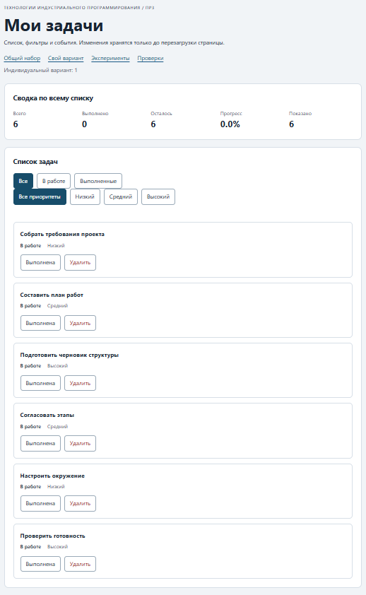

# Практическая работа № 3. Работа с DOM и событиями

## Данные работы

| Поле | Значение |
|---|---|
| Имя | Кутлунин Константин Русланович |
| Группа | ЭФБО-15-25 |
| Вариант из ПР2 | 1 (номер по списку — 17) |
| Node.js | v24.21.0 |
| Браузер | Chrome (DevTools) |
| Операционная система | Windows |

## Запуск

Рабочая папка: `practice-03` внутри личного репозитория.

```bash
npm run check:service
npm start
```

Устанавливать зависимости через `npm install` не требуется.

```text
http://127.0.0.1:5503/
http://127.0.0.1:5503/index.html?dataset=variant
http://127.0.0.1:5503/examples/dom-events.html
http://127.0.0.1:5503/checks.html
```

Остановка сервера: `Ctrl+C`.

## Что перенесено из ПР2

Файлы `src/task-service.js` и `src/data.js` перенесены из ПР2 без изменений. Результат повторной проверки: 35 пройденных сценариев, 0 ошибок.

## Эксперименты

| № | До запуска: прогноз | После запуска: результат | Объяснение |
|---:|---|---|---|
| 1. Отсутствующий элемент и коллекция | `null` и `0` | `null`, `0` | `querySelector` возвращает `null`, `querySelectorAll` — пустой NodeList длиной 0. |
| 2. dataset и числовой id | `"23"`, `string`; `23`, `number` | `"23"`, `string`; `23`, `number` | `dataset` хранит строки; `Number()` преобразует в число. |
| 3. Статический NodeList | Старый — 1, новый — 2 | Старый — 1, новый — 2 | Сохранённый NodeList не обновляется; нужен новый запрос. |
| 4. Строка с HTML-разметкой | Текст с `<strong>`, без элемента | Текст с `<strong>`, без элемента | `textContent` выводит строку как текст. |
| 5. Распространение события | Захват → цель → всплытие | Захват → цель → всплытие | Событие всплывает от span к кнопке и контейнеру. |

## Организация кода

- `task-service.js` — прикладные функции ПР2 (без DOM).
- `task-selectors.js` — `getVisibleTasks` для фильтрации по статусу.
- `task-view.js` — создание карточек, отрисовка списка, сводки, пустого состояния.
- `main.js` — состояние (`currentTasks`, `currentFilter`, `currentPriority`), обработчики событий и вызовы сервиса.

Полный список хранится в `currentTasks`, фильтр — в `currentFilter` и `currentPriority`. Сводка вычисляется через `getTaskStats(currentTasks)`.

## Общий сценарий

| Шаг | Видимые id | Всего | Выполнено | Осталось | Прогресс | Показано | Сообщение | Совпало с ожиданием |
|---:|---|---|---|---|---|---|---|---|
| 0 | [1, 4, 7, 10] | 4 | 2 | 2 | 50.0% | 4 | — | Да |
| 1 | [4, 7] | 4 | 2 | 2 | 50.0% | 2 | — | Да |
| 2 | [7] | 4 | 3 | 1 | 75.0% | 1 | — | Да |
| 3 | [1, 4, 7, 10] | 4 | 3 | 1 | 75.0% | 4 | — | Да |
| 4 | [1, 4, 10] | 3 | 3 | 0 | 100.0% | 3 | — | Да |
| 5 | [] | 3 | 3 | 0 | 100.0% | 0 | Нет задач по выбранному фильтру. | Да |
| 6 | [1, 4, 10] | 3 | 2 | 1 | 66.7% | 3 | — | Да |
| 7 | [] | 0 | 0 | 0 | 0.0% | 0 | Список задач пуст. | Да |

После перезагрузки состояние возвращается к шагу 0. Это ожидаемое поведение ПР3.

## Индивидуальный вариант

**Тема:** «Подготовка учебного проекта».  
**Исходные данные:** `src/data.js`, массив `variantTasks` с 6 задачами (id 11, 23, 37, 41, 58, 64).

| Этап | Всего | Выполнено | Осталось | Прогресс | Видимые id |
|---|---|---|---|---|---|
| До действий | 6 | 0 | 6 | 0.0% | [11, 23, 37, 41, 58, 64] |
| После переключения 23 | 6 | 1 | 5 | 16.7% | [11, 23, 37, 41, 58, 64] |
| После удаления 37 | 5 | 1 | 4 | 20.0% | [11, 23, 41, 58, 64] |
| Итог, фильтр «В работе» | 5 | 1 | 4 | 20.0% | [11, 41, 58, 64] |
| Итог, фильтр «Выполненные» | 5 | 1 | 4 | 20.0% | [23] |

## Протокол проверки сервиса

```text
OK: 01. Создание задачи с явным приоритетом
OK: 02. Приоритет по умолчанию
OK: 03. Удаление краевых пробелов без изменения внутренних
OK: 04. Граничные длины названия и положительный безопасный id
OK: 05. Некорректные названия при создании
OK: 06. Некорректные идентификаторы при создании
OK: 07. Все допустимые приоритеты и отклонение недопустимых
OK: 08. Каждый вызов createTask возвращает новый объект
OK: 09. Поиск по id, а не по индексу
OK: 10. Отсутствующая задача и пустой массив при поиске
OK: 11. Поиск не преобразует строковый id в число
OK: 12. Получение невыполненных задач
OK: 13. Пустой список, все выполнены и все не выполнены
OK: 14. Названия в исходном порядке и пустой список
OK: 15. Сводка по общему набору
OK: 16. Сводка по пустому списку
OK: 17. Сводка: ничего не выполнено и выполнено всё
OK: 18. Процент остаётся числом без предварительного округления
OK: 19. Добавление в конец без изменения входного массива
OK: 20. Добавление в пустой список с приоритетом по умолчанию
OK: 21. Повторяющийся id отклоняется
OK: 22. Добавление не обходит проверки createTask
OK: 23. Изменение completed в обе стороны
OK: 24. completed принимает только boolean
OK: 25. Некорректный или отсутствующий id при изменении статуса
OK: 26. Повторная установка статуса создаёт новый результат
OK: 27. Переименование сохраняет остальные поля
OK: 28. Проверки названия при переименовании
OK: 29. Некорректный или отсутствующий id при переименовании
OK: 30. Удаление по id с сохранением порядка
OK: 31. Удаление единственной записи
OK: 32. Некорректный, отсутствующий id и удаление из пустого списка
OK: 33. Входные объекты не изменяются ни одной операцией
OK: 34. Общий сценарий и все промежуточные сводки
OK: 35. Работа с другим набором, без зависимости от demoTasks

Проверок пройдено: 35; не пройдено: 0.
```

## Протокол браузерных проверок

```text
OK: Фильтр all возвращает новый массив в исходном порядке
OK: Фильтр pending выбирает невыполненные задачи
OK: Фильтр completed выбирает выполненные задачи
OK: Все три фильтра работают с пустым списком
OK: Фильтрация не меняет входные записи и их порядок
OK: Карточка — li.task-card с числовым id в dataset
OK: Статус невыполненной карточки и aria-pressed согласованы
OK: Статус выполненной карточки и aria-pressed согласованы
OK: В карточке две обычные кнопки с вложенными подписями
OK: Все приоритеты отображаются по установленному словарю
OK: Название с разметкой отображается текстом
OK: Отрисовка списка создаёт карточки в исходном порядке
OK: Повторная отрисовка не накапливает карточки
OK: Контейнер списка и его обработчик сохраняются
OK: Отрисовка пустого массива очищает прежние карточки
OK: Сводка считается по всему списку, отдельно выводится Показано
OK: Пустая сводка не содержит NaN и Infinity
OK: Сообщение для полностью пустого списка
OK: Сообщение для пустого результата фильтра
OK: Появление карточек скрывает прежнее пустое состояние
OK: Приложение: начальный набор и сводка
OK: Приложение: фильтр срабатывает по клику на вложенный span
OK: Приложение: активный фильтр отмечен классом и aria-pressed
OK: Приложение: фильтрация не удаляет скрытые задачи
OK: Приложение: переключение по id, а не индексу массива
OK: Приложение: выполненная задача исчезает из фильтра В работе
OK: Приложение: удаление изменяет данные, а не только DOM
OK: Приложение: клик по названию не изменяет данные
OK: Приложение: после перерисовок одно нажатие — одно изменение
OK: Приложение: удаление всех записей и нулевая сводка
OK: Приложение: нет совпадений — не то же самое, что нет задач
OK: Приложение: неизвестный числовой id не меняет данные
OK: Приложение: id 4abc не превращается в 4
OK: Приложение: неизвестное действие игнорируется
OK: Приложение: после изменения сохраняется клавиатурный фокус
OK: Приложение: новая загрузка возвращает исходное состояние

Всего: 36. Пройдено: 36. Ошибок: 0.
```

## Собственные проверки

| № | Исходное состояние и действия | Ожидаемый результат | Фактический результат | Итог |
|---:|---|---|---|---|
| 1 | «В работе» + «Высокий» | Только `id = 37` и `id = 64` | `[37, 64]` | Пройдено |
| 2 | «Выполненные» + «Низкий» | `[]`, сообщение «Нет задач по выбранному фильтру.» | `[]` | Пройдено |
| 3 | «Все приоритеты» + «Все» после фильтров | 6 задач `[11, 23, 37, 41, 58, 64]` | `[11, 23, 37, 41, 58, 64]` | Пройдено |

## Отладка и клавиатура

Точка останова установлена на строке чтения `dataset.taskId` в `handleTaskListClick`. Зафиксировано:
- `event.target` — вложенный `span.action-label`.
- `event.currentTarget` — `ul#task-list`.
- `dataset.taskId` — строка `"4"`.
- Числовой `id` после `Number()` — `4`.
- Действие — `"toggle"`.

Проверено: Tab, Enter, Space работают, фокус сохраняется после изменения статуса и удаления.

## Вид приложения



## Дополнительное задание

**Выбранный вариант:** Вариант А — дополнительный фильтр по приоритету.

**Правила поведения:**
- Добавлена группа кнопок `#priority-filters` с четырьмя режимами: `all`, `low`, `medium`, `high`.
- Фильтр по приоритету применяется **совместно** с фильтром по статусу.
- Общая сводка рассчитывается по полному массиву, а «Показано» — по совместной выборке.
- Возврат обоих фильтров в `all` восстанавливает исходный список.

**Проверки:**

| Проверка | Входные данные и действия | Ожидаемый результат | Фактический результат | Итог |
|:---|:---|:---|:---|:---:|
| Совместный фильтр | «В работе» + «Высокий» | Только `id = 37`, `id = 64` | `[37, 64]` | Пройдено |
| Пустой результат | «Выполненные» + «Низкий» | `[]`, сообщение | `[]` | Пройдено |
| Возврат в «Все» | «Все приоритеты» + «Все» | `[11, 23, 37, 41, 58, 64]` | `[11, 23, 37, 41, 58, 64]` | Пройдено |

## Вывод

В ходе работы освоены: работа с DOM, делегирование событий, `closest`, `dataset`, `textContent`, фильтрация и обновление интерфейса. Проверено, что удаление DOM-узла не является удалением данных: состояние хранится в `currentTasks` и обновляется только через функции ПР2. Различие между изменением данных и изменением DOM показано на примере удаления: `removeTask` возвращает новый массив, и только после этого вызывается `renderApp()`.
